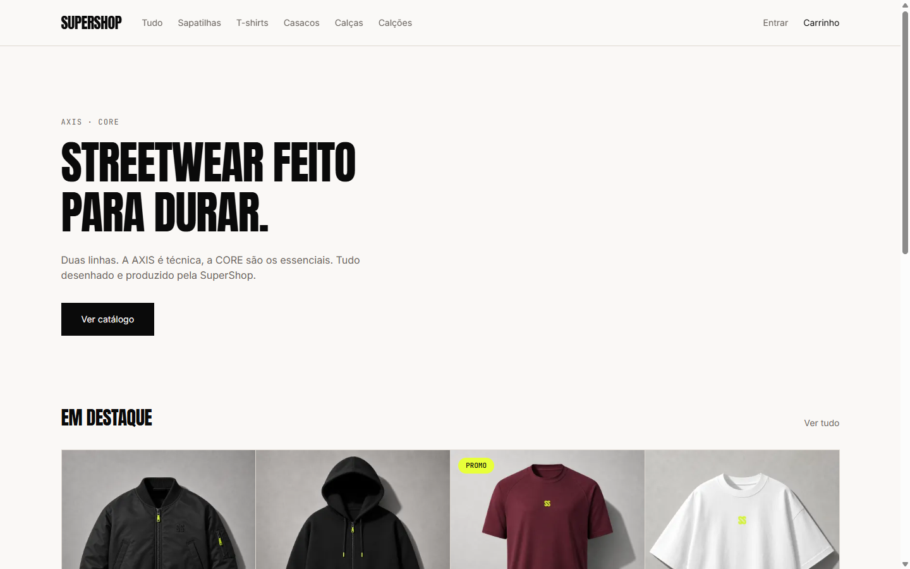
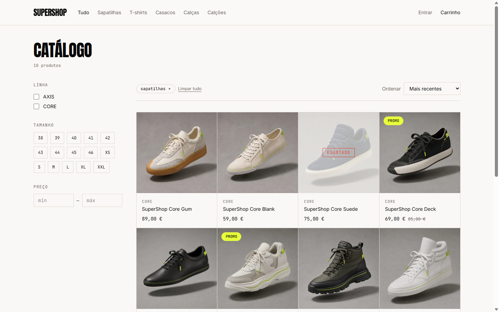
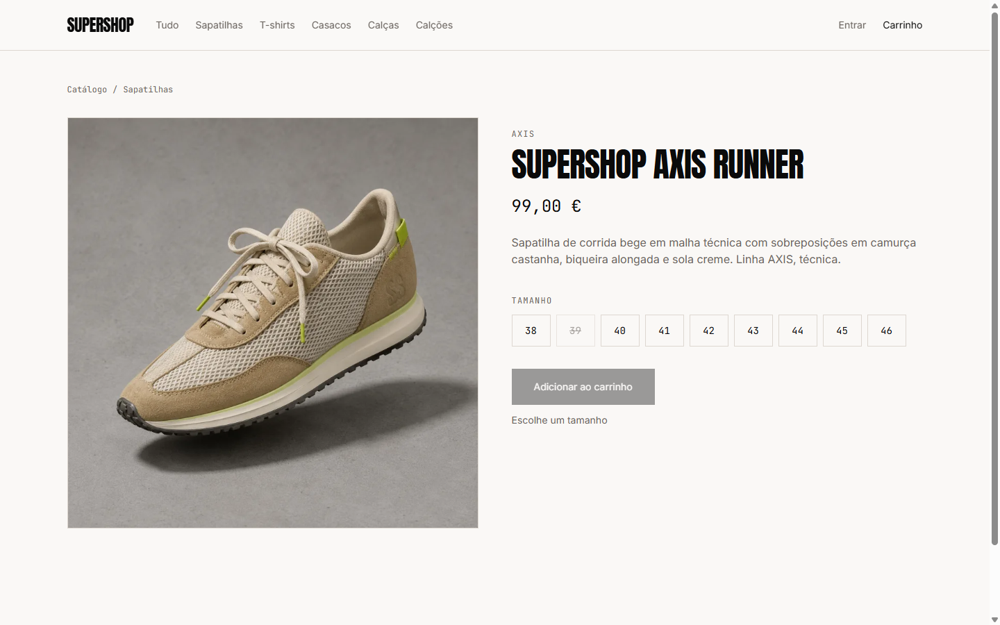
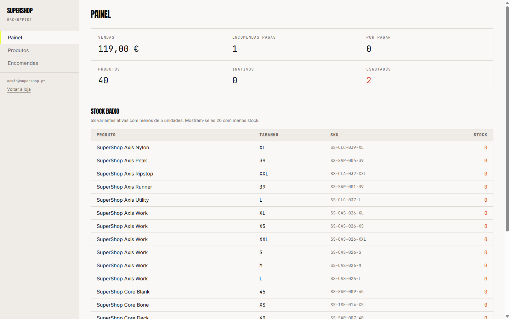
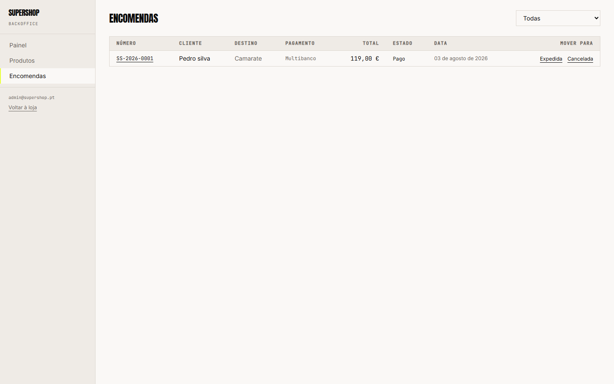
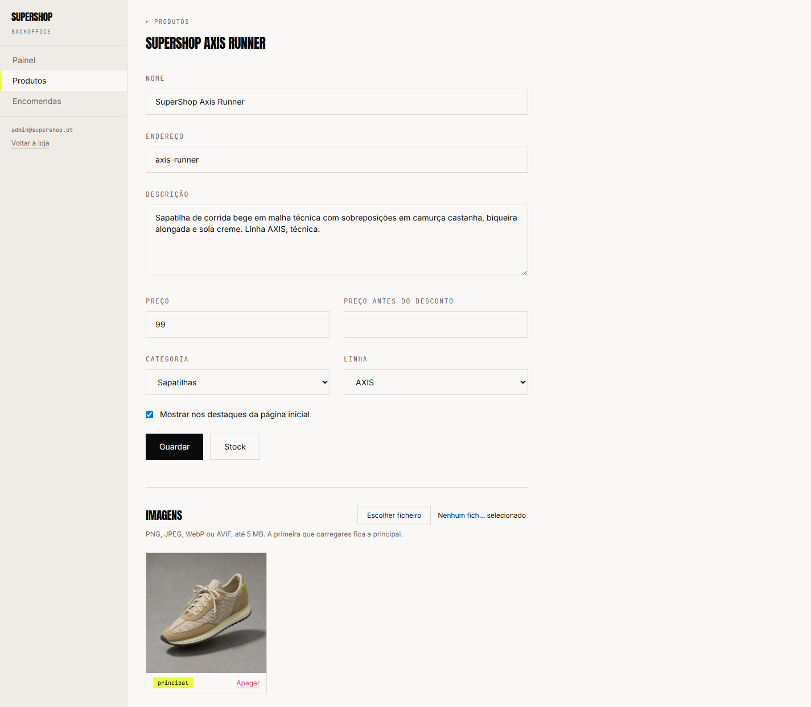

# SuperShop

[](https://github.com/KennedySilva8907/supershop-store/actions/workflows/ci.yml)

An online clothing store, running at **[supershop.pt](https://supershop.pt)**.

A customer can browse a catalogue of 40 products, filter and search it, put
things in a cart, and buy with one of four payment methods. An administrator
can run the shop from a backoffice: products, images, stock, and moving orders
through their states.

The API stops when nothing is using it, so the first request after a quiet
period takes a few seconds. That is the hosting plan, not the application, and
[the reason is below](#hosting-and-what-free-tiers-cost).



## Stack

| Layer | Technology |
| --- | --- |
| API | ASP.NET Core 10, EF Core, PostgreSQL |
| Auth | ASP.NET Core Identity, JWT with refresh tokens |
| Frontend | React 19, Vite, TypeScript, Tailwind CSS |
| Images | Cloudinary |
| Tests | xUnit, Testcontainers |
| Hosting | Fly.io, Vercel, Neon |

## The shop

Filters live in the URL, so the back button works and a filtered catalogue can
be shared as a link. Sold out sizes stay visible and disabled rather than
disappearing, because hiding them makes people think the size never existed.

| Catalogue | Product |
| --- | --- |
|  |  |

## The backoffice

Its own layout, dense where the shop is generous. Stock saves per row. Orders
only offer the state changes the API will accept, so a finished order shows no
buttons rather than ones that would be refused.

| Dashboard | Orders |
| --- | --- |
|  |  |

Products are created and edited here, with images going straight to Cloudinary.



## How it is put together

```text
backend/
  src/
    SuperShop.Domain/          entities, enums, business rules. References nothing
    SuperShop.Application/     services, DTOs, and the interfaces the outside implements
    SuperShop.Infrastructure/  EF Core, Identity, Cloudinary, e-mail
    SuperShop.Api/             controllers, middleware, wiring
  tests/                       126 unit, 44 integration
frontend/                      React application
assets/                        brand assets
```

Dependencies point inward only. `Domain` references no package and no project,
so the rules about stock, shipping and order transitions can be tested without
a database, a web server, or a mock of either.

The interfaces live in `Application` and are implemented in `Infrastructure`,
which is why no service knows Cloudinary exists. Swapping it for something else
means writing `IImageStorage` again and changing one line of registration.

### Three decisions worth explaining

**Stock is held from `Paid` onwards**, decided by a single predicate that both
the debit and the return read. Two separate conditions would eventually
disagree, and a shop that loses track of stock is worse than one that is slow.

**An order copies what it needs.** Product name, size, SKU and unit price are
written onto the order line, and the address onto the order. A price change
tomorrow cannot rewrite what somebody bought today.

**Nothing touches the database on startup.** Migrations and seeding are
commands, in every environment, so a deployment cannot quietly reshape
production because a container restarted.

## Tests and CI

Four jobs on every push and pull request.

| Job | What it does |
| --- | --- |
| Backend | restore, build in Release, 126 unit and 44 integration tests |
| Frontend | `npm ci`, type check, lint, build |
| Container | builds the image, runs it against a throwaway database, checks it answers and is not running as root |
| Deploy API | only on `main`, only after the other three pass |

The integration tests run against a real PostgreSQL in a container through
Testcontainers, not an in-memory provider, because an in-memory provider does
not behave like PostgreSQL and the tests exist to catch what unit tests cannot.
They found three real problems on their first run.

The container job exists because an image that builds is not the same as an
image that runs. It has already caught a catalogue answering 500 while the
health check said everything was fine.

Both halves publish themselves on a merge, and the deploy waits for
`/health/ready` before calling itself done. For a while only the store
published itself, and production ended up with a shop calling endpoints the API
did not have yet.

## Requirements

- .NET SDK 10
- Node 22 or later
- Docker Desktop, for PostgreSQL and integration tests

## Getting started

```bash
docker compose up -d
cd backend && dotnet run --project src/SuperShop.Api
cd frontend && npm ci && npm run dev
```

## Frontend dependencies

Use `npm ci`, not `npm install`, unless you are deliberately changing a
dependency.

Tailwind ships platform specific binaries. On Windows, `npm install` drops the
`wasm32-wasi` packages and the `@emnapi` entries they need, because they do not
apply to the local platform. The lock file then no longer matches what CI
resolves on Linux, and `npm ci` there fails with
`Missing: @emnapi/runtime from lock file`.

When a dependency really has to change, regenerate the lock file on Linux so it
carries every platform:

```bash
docker run --rm -v "$PWD:/app" -w /app node:22-slim \
  sh -c "rm -rf node_modules package-lock.json && npm install"
```

The result works on both systems. On Windows `npm ci` installs only the local
packages and leaves the lock file untouched.

## Configuration

No secrets in the repository. `appsettings.json` ships with empty keys.
Development uses User Secrets, production uses platform environment variables.

| Variable | Purpose |
| --- | --- |
| `ConnectionStrings__DefaultConnection` | PostgreSQL |
| `Jwt__Secret` | Token signing, 32 bytes minimum |
| `Cloudinary__Url` | Image storage |
| `Email__ApiKey` | Transactional email |
| `Admin__Email` / `Admin__Password` | Admin seed |
| `RateLimit__AuthPermitPerMinute` | Sign in attempts per minute per IP, default 5 |
| `Auth__FrontendOnAnotherSite` | `true` only when the store is not on a subdomain of the API's site |

The refresh cookie is `SameSite=Strict`, which is what the store and the API
sharing `supershop.pt` allows, and it is the strongest of the three: the
browser refuses to send it on any request that starts somewhere else.

Put the store on a different site and that same setting silently stops the
session from renewing, because a `Strict` cookie never crosses sites. That is
what `Auth__FrontendOnAnotherSite` is for, and it only takes effect over HTTPS,
since `SameSite=None` requires `Secure`.

## Hosting and what free tiers cost

The API and the database must sit in the same region. A round trip across the
Atlantic adds 100 to 200 ms to every query, and a page making ten queries pays
that ten times. Both halves run in Frankfurt.

Fly has no free allowance for new organisations, so idle time is billed. The
machine therefore stops when nothing is using it and starts again on the next
request, which costs a few seconds on that request and almost nothing a month.
Keeping it always on removes the wait and costs about $3.32 a month.

`stop` rather than `suspend`. Suspending resumes faster, but the machine clock
drifts across a suspend, and tokens are validated against it. Stopping gives a
fresh process, a fresh connection pool and a correct clock.

A pooled connection string keeps the database from being reconnected on every
request, which matters more than either of these.

### Images

Cloudinary builds each size the first time somebody asks for it. Measured on a
catalogue image, same URL, from the same machine:

| | |
| --- | --- |
| Size already cached | 40 to 77 ms |
| Size never requested before | 529 ms |
| The same one immediately after | 41 ms |

On a shop with little traffic the cache expires, so the first visitor after a
quiet stretch pays that on every image on the page. Asking for all of them once
puts them back:

```bash
./scripts/warm-images.sh
```

Worth running after adding products, and after changing the widths in
`cloudinary.ts`, since a new width has never been built for any image.

## Deployment

Migrations are applied by explicit command, never automatically on startup:

```bash
dotnet ef database update --project src/SuperShop.Infrastructure \
  --startup-project src/SuperShop.Api
```

The catalogue and the administrator are seeded by the same principle, with an
explicit command against the deployed image:

```bash
dotnet SuperShop.Api.dll --seed
```

It is idempotent. Products already present are left alone, and the
administrator is created only if the e-mail is not taken.

The API ships as a container. It runs as an unprivileged user and exposes
`/health` for liveness and `/health/ready` for database readiness, which is the
one a platform should poll.

Both halves publish themselves on a merge to `main`: the store through Vercel,
the API through the `Deploy API` job, which only runs after the other three
pass. It waits for `/health/ready` afterwards, so a deployment that starts but
never answers fails the run instead of going quietly.

For a while only the store published itself, and the API had to be pushed by
hand. That is how production ended up with a store calling endpoints the API
did not have yet.

The job needs `FLY_API_TOKEN` in the repository secrets. It is scoped to this
one application rather than the whole account:

```bash
fly tokens create deploy --app supershop-api --name github-actions
```
